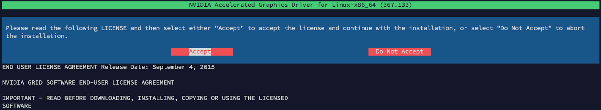
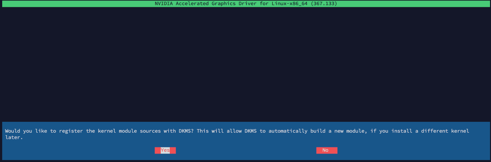
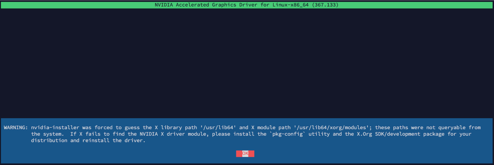
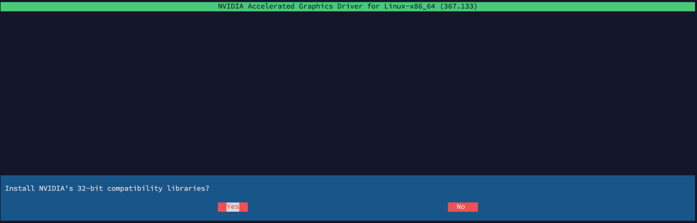
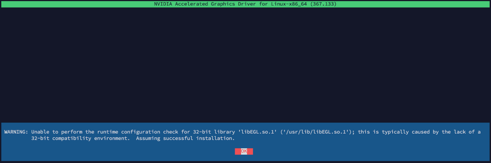
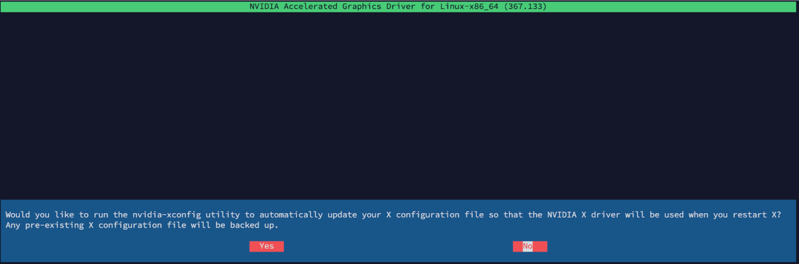
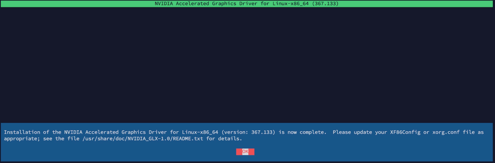
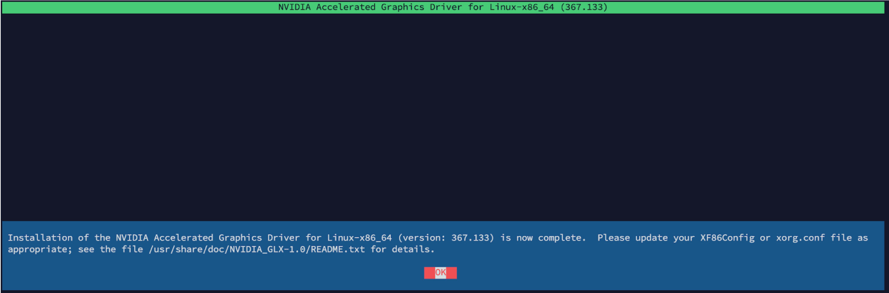
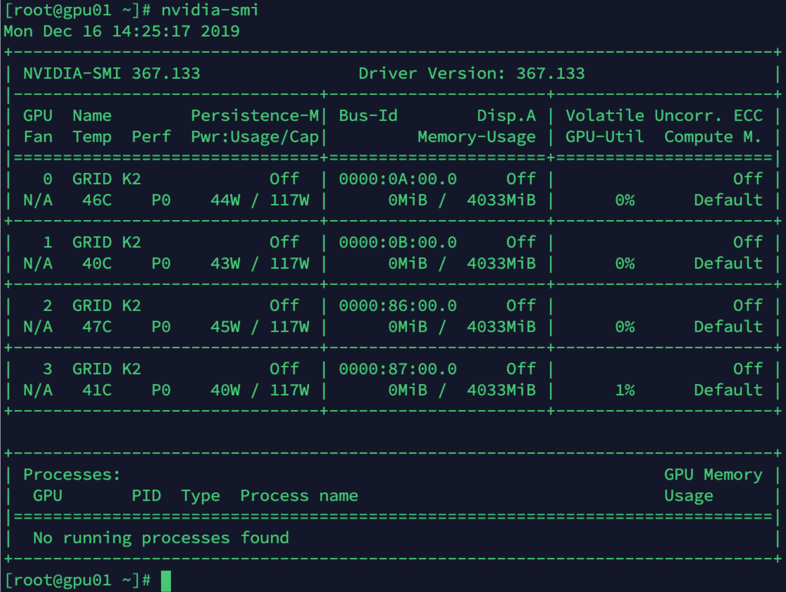
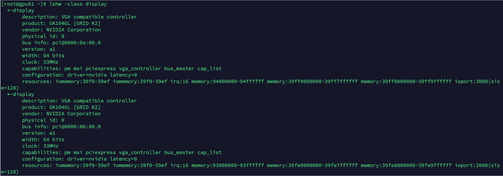

Cụm transcode GPU dùng đồng bộ VGA NVIDIA GRID K2.

Vì driver mặc định của Centos 7.6.1810 không tương thích với VGA nên dẫn đến dump OS.

Để cài được OS thì phải Disable 2 chân PCI VGA để CPU không bị dump mỗi khi boot.

Trong khi chạy ansible thì sẽ disable driver mặc định của CentOS.

Sau khi đã disable driver mặc định của CentOS thì có thể reboot để enable 2 chân PCI trong BIOS lên và tiến hành cài đặt driver cho VGA.


**Ansible sẽ chỉnh sửa cấu hình grub và cài đặt các gói cần thiết. Bước sau cùng chỉ là reboot để enable 2 PCI VGA lên rồi cài đặt driver. Nếu muốn thực hiện thủ công thì có thể làm theo hướng dẫn bên dưới.**

disable driver mặc định của CentOS
```
vi /etc/default/grub
GRUB_CMDLINE_LINUX="crashkernel=auto rhgb quiet modprobe.blacklist=nouveau"
```

```
vi /etc/modprobe.d/blacklist.conf
blacklist nouveau
options nouveau modeset=0
```

Update lại grub

```grub2-mkconfig -o /boot/grub2/grub.cfg```

Reboot để enable 2 chân PCI VGA lên.

Check xem các GPU đang có

```lshw -class display```

Xác định kernel mà CentOS đang chạy.
```
[root@gpu01 ~]# uname -a
Linux gpu01.hcm.fpt 3.10.0-957.el7.x86_64 #1 SMP Thu Nov 8 23:39:32 UTC 2018 x86_64 x86_64 x86_64 GNU/Linux
```
Sau đó cài kernel-headers và kernel-devel đúng như kernel đang chạy.

```yum install kernel-headers kernel-devel```

Cài đặt Development Tools

```yum group install "Development Tools"```

Nếu không install được group “Development Tools” thì có thể cài từng gói

```yum install bison yacc cscope ctags cvs diff stat doxygen flex gcc gcc-c++ gcc-gfortran gettext git indent intltool libtool patch patchutils rcs redhat-rpm-config rpm-build subversion swig systemtap```

Cài đặt dkms

```yum  install dkms```

Tải và cài đặt driver

```
wget -v http://repo.glxplay.io/CentOS/7.6.1810/vga-drivers/nvidia-grid-k2/NVIDIA-Linux-x86_64-367.133-grid.run
bash NVIDIA-Linux-x86_64-367.133-grid.run
```










Sau khi cài đặt driver xong thì có thể kiểm tra bằng các lệnh sau:
```
lshw -class display
nvidia-smi
```



